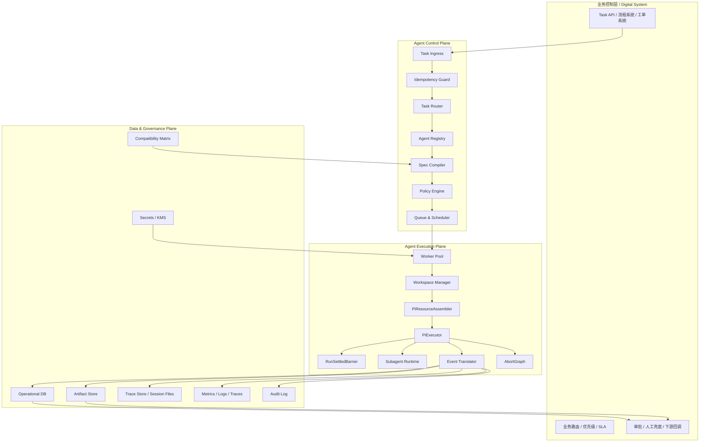
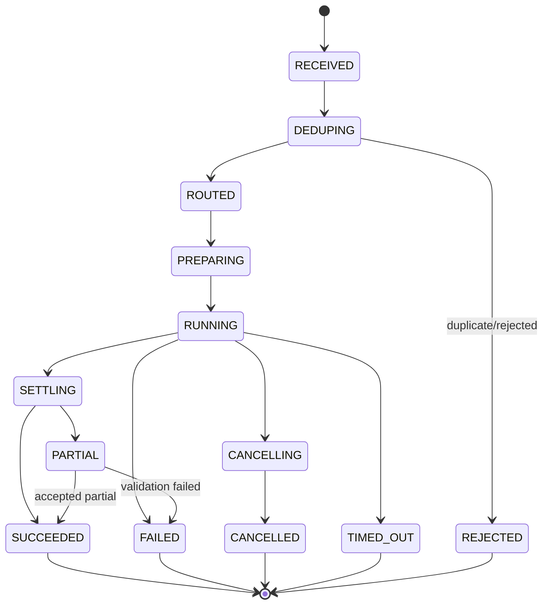
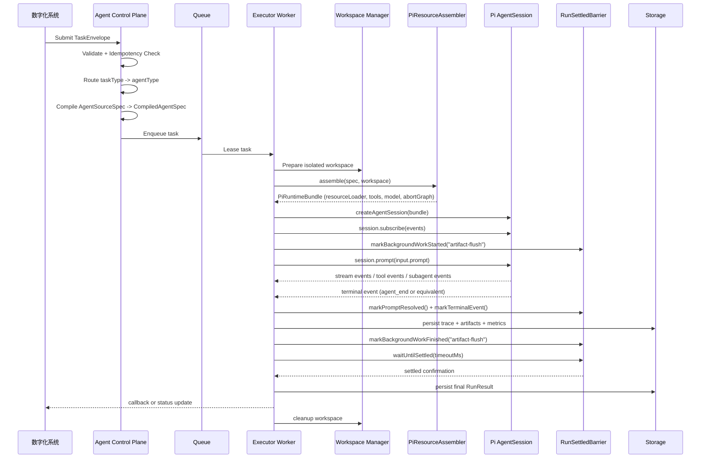

# Pi Agent 接入企业数字化系统：生产级项目架构与编排设计

版本：v3.0（最终版）  
状态：可直接指导工程实现  
目标读者：架构师、平台工程师、后端负责人、Codex/自动化实现代理  
适用范围：基于 `pi-agent-core`、`pi-ai`、`pi-coding-agent` 构建企业级 Agent 执行平台，接入已有数字化系统的任务流、工单流、审批流、知识流、代码流  
基线：Pi SDK（`@mariozechner/pi-coding-agent`）、OpenClaw 集成架构、oh-my-pi swarm extension、pi-subagents 社区扩展

---

## 1. 文档目的

本文档给出一套**与 demo 解耦**的、可直接进入工程实现的生产级方案，用于将 Pi Agent 能力接入企业已有数字化系统。

目标不是做一个"会聊天的 Agent"，而是建设一个可审计、可隔离、可重试、可观测、可灰度发布、可多租户治理的 **Agent Execution Platform**。

本文档明确采用以下总体判断：

1. **数字化系统负责控制面（Control Plane）**：任务创建、路由、优先级、SLA、审批、回调、审计。
2. **Pi 负责执行面（Execution Plane）**：单任务推理、工具调用、技能装配、上下文处理、子任务委托。
3. **主模式为"一任务一会话（One Task = One Agent Session）"**：外部系统不要依赖一个长寿命主 session 来承接所有业务任务。
4. **subagent 只作为任务内部编排能力**：用于同一任务内部的 scout / planner / worker / reviewer 等细分协作，不承担企业级全局调度。
5. **业务状态与 Pi Session 分离**：Pi session 负责 trace 与 replay；业务系统负责真实任务状态与结果归档。

> **一句话总结：把 Pi 当作"可编排的执行引擎"，不要把它当成"企业主控系统本身"。**

---

## 2. 为什么这样设计

Pi 官方 SDK 将 `createAgentSession()` 定义为单个 `AgentSession` 的主入口，`ResourceLoader` 负责 extensions、skills、prompt templates、themes 和 context files 的供应；`AgentSession` 自身管理生命周期、消息历史、compaction 和事件流。这个抽象天然适合"一任务一会话"的执行模型。

OpenClaw 的官方文档同样表明，它是通过 Pi SDK 直接把 `AgentSession` 嵌入到自己的网关/消息架构里，而不是把 Pi 当黑盒 CLI 调用；同时它把运行管理、工具策略、session 缓存、compact 处理、model 选择、auth profile 与 failover 都拆成独立模块。这正说明生产系统不应把全部职责塞进一个 `AgentExecutor` 类。

Pi 低层事件序列也说明，带工具调用的任务会出现多次 `turn_end`，而 `agent_end` 才表示本轮 agent loop 结束；因此不能把 `turn_end` 直接当作最终完成信号。与此同时，Pi 生态最近还有关于"需要更强 settled 语义"和"某些自动重试场景下 `session.prompt()` 过早 resolve"的 issue 讨论，所以生产平台应自己实现完成屏障，而不是迷信单一事件或单一 Promise。

---

## 3. 核心设计决策（ADR）

### ADR-01：任务粒度
**决策**：每个业务任务默认启动一个独立 `AgentSession`。  
**原因**：上下文隔离、并发友好、易追溯、便于超时控制与重试。  
**结论**：长期主 session 不是企业任务分发的主承载结构。

### ADR-02：配置粒度
**决策**：业务定义文件（`soul.md`、`agent.md`、skills、extensions）不直接喂给 SDK，而是先编译成不可变 `CompiledAgentSpec`。  
**原因**：支持版本化、灰度、回滚、审计、可重复执行。  
**结论**：不要让运行时直接临时拼装一堆 prompt 文件后立即执行。

### ADR-03：结果模型
**决策**：业务结果 `result`、执行产物 `artifacts`、过程痕迹 `trace` 三者分离。  
**原因**：最终业务结果通常是结构化数据，而运行中会产生 diff、日志、报告、截图、补丁、summary 等衍生产物，过程痕迹则面向调试审计。  
**结论**：不要只返回一段 assistant 文本。

### ADR-04：工作区模型
**决策**：所有可写任务必须独占 workspace；只读任务才允许共享只读快照。  
**原因**：避免多任务文件竞争、工具竞态、脏数据污染。  
**结论**：只做只读分析时可共享基础仓库快照；涉及写操作时必须隔离。

### ADR-05：完成判定
**决策**：最终完成由平台侧 `RunSettledBarrier` 判定，而不是直接把 `turn_end`、`agent_end` 或 `session.prompt()` resolve 任一者当唯一真相。  
**原因**：带工具调用的任务会出现多次 `turn_end`；`agent_end` 更接近但仍不覆盖 auto-retry 和后台 subagent 场景；`session.prompt()` 在部分边界条件下可能过早 resolve。  
**结论**：平台使用"Promise 返回 + 终止性事件 + 无后台工作 + finalizer 通过"的组合判定。

### ADR-06：外部集成模式
**决策**：Node/TS 内嵌场景优先 SDK；跨语言或强进程隔离场景使用 RPC Worker。  
**原因**：SDK 提供类型安全与细粒度控制；RPC 提供语言无关与强隔离。  
**结论**：SDK 与 RPC 同时保留，但不要混用为同一任务链路的默认模式。

---

## 4. 目标与非目标

### 4.1 目标

- 对接现有数字化系统的任务分发体系
- 支持按任务类型调用预定义 Agent
- 支持异步任务、同步任务、回调任务三种执行方式
- 支持结构化结果（`submit_result` 协议工具）、文件产物、日志、trace 回传
- 支持多 Agent 类型与多版本治理
- 支持模型路由、Provider Failover、工具策略、成本预算、超时控制
- 支持故障恢复、重试、取消（AbortGraph 端到端传播）、幂等
- 支持 Compaction 策略与长任务上下文治理
- 支持多租户与安全审计
- 支持任务内部 subagent 编排（chain / parallel / dag-lite）
- 支持 Extension 治理与 SDK 版本兼容基线

### 4.2 非目标

- 不把 Pi session 作为企业业务主数据库
- 不把 subagent 当成企业级总调度系统
- 不追求所有任务都实时流式输出
- 不要求所有 Agent 都具备写代码/执行 bash 能力
- 不依赖单一模型厂商或单一 prompt 文件布局
- 不把平台锁死到某个 Pi SDK 历史版本号

---

## 5. 设计原则

1. **控制面与执行面分离**：调度与推理不能耦合在同一个类里。
2. **Spec 不可变**：每次执行必须能追溯到唯一版本的 Agent 定义（`specId` 内容寻址）。
3. **任务上下文最小化**：默认只带必要输入，避免把历史会话当成垃圾桶。
4. **工具默认最小权限**：按 Agent 类型放开，而不是统一全开放（deny-by-default）。
5. **工作区强隔离**：写操作先隔离，再执行，再回收。
6. **产物优先归档**：结果可重算，但产物与审计链不能丢。
7. **失败可解释**：失败必须能区分模型失败、工具失败、平台失败、业务校验失败。
8. **运行可中断**：取消、超时、人工终止都必须可传播到执行层（AbortGraph）。
9. **接口面向业务系统**：业务 API 只认识 `TaskEnvelope` 与 `RunResult`，不允许把 Pi 原始事件对象向上层泄漏。
10. **先跑通最小链路，再扩展多智能体与高级策略**。

---

## 6. 总体架构



---

## 7. 分层职责

### 7.1 业务控制层（现有数字化系统）

负责：
- 创建业务任务
- 决定 `taskType`、优先级、SLA、审批流
- 传入业务输入、附件引用、回调信息
- 接收完成结果、人工兜底和后续流程触发

不负责：
- 不直接拼装 Pi prompt
- 不直接调用 `createAgentSession()`
- 不直接解析 Pi 原始事件
- 不直接管理 subagent 生命周期

### 7.2 Agent Control Plane

负责：
- 把业务输入归一化为 `TaskEnvelope`
- 进行幂等、配额、租户、优先级治理
- 将 `AgentSourceSpec` 编译成 `CompiledAgentSpec`
- 选择模型策略、工具策略、workspace 策略、compaction 策略
- 把任务派发到 worker queue

### 7.3 Agent Execution Plane

负责：
- 领取任务 lease
- 准备 workspace
- 通过 `PiResourceAssembler` 构造 Pi 运行时
- 执行 `PiExecutor`
- 翻译事件并上报（EventTranslator）
- 处理取消、超时、重试、failover、subagent（AbortGraph）
- 抽取结构化结果与 artifacts
- 通过 `RunSettledBarrier` 确认最终完成

### 7.4 Data & Governance Plane

负责：
- 平台任务状态机
- artifact 存储
- session/trace 存储
- 指标、日志、链路追踪
- secrets 管理
- 审计与合规
- SDK 版本兼容基线（Compatibility Matrix）

---

## 8. 核心域模型

### 8.1 ArtifactRef

```ts
export interface ArtifactRef {
  artifactId: string;
  kind: string;
  uri: string;
  digest?: string;
  mediaType?: string;
  title?: string;
  sizeBytes?: number;
}
```

### 8.2 TaskEnvelope

```ts
export interface TaskEnvelope {
  taskId: string;
  runRequestId: string;
  idempotencyKey: string;
  tenantId: string;
  taskType: string;            // 业务任务类型，例如 code.review / requirement.analysis
  agentType: string;           // 路由后确定的 Agent 类型
  agentVersionSelector?: string; // 可选，支持固定版本或灰度
  priority: "p0" | "p1" | "p2" | "p3";
  triggerType: "sync" | "async" | "callback";
  timeoutMs: number;
  deadlineAt?: string;         // ISO 8601，若设置则优先于 timeoutMs
  callback?: {
    url?: string;
    topic?: string;
    headers?: Record<string, string>;
  };
  input: {
    prompt: string;
    structuredInput?: Record<string, unknown>;
    contextRefs?: ArtifactRef[];
    metadata?: Record<string, unknown>;
  };
  constraints?: {
    maxCostUsd?: number;
    maxTokens?: number;
    allowWrite?: boolean;
    allowNetwork?: boolean;
    allowSubagents?: boolean;
    requireHumanApproval?: boolean;
  };
  trace: {
    correlationId: string;
    parentTaskId?: string;
    requester?: string;
    sourceSystem?: string;
  };
}
```

### 8.3 AgentSourceSpec

人类维护的源定义，通常来自 Git 仓库或配置中心。不直接喂给 Pi SDK。

```ts
export interface AgentSourceSpec {
  agentType: string;
  version: string;
  displayName: string;
  description?: string;

  soulMd?: string;             // soul.md 内容或路径
  agentMd?: string;            // agent.md 内容或路径
  agentsFiles?: Array<{ path: string; content: string }>;

  skillRefs: string[];
  extensionRefs: string[];
  promptTemplates?: string[];

  defaultModelPolicy: ModelPolicy;
  defaultToolPolicy: ToolPolicy;
  defaultWorkspacePolicy: WorkspacePolicy;
  defaultCompactionPolicy: CompactionPolicy;
  outputContract?: OutputContract;
  sessionReusePolicy?: SessionReusePolicy;
  subagentPolicy?: SubagentPolicy;

  metadata?: Record<string, unknown>;
}
```

### 8.4 CompiledAgentSpec

运行时真正使用的不可变版本。由编译器生成并带内容寻址哈希。

```ts
export interface CompiledAgentSpec {
  specId: string;                    // SHA-256 内容寻址

  agentType: string;
  version: string;
  displayName: string;

  sdkCompatibility: {
    packageName: "@mariozechner/pi-coding-agent";
    exactVersion: string;            // 在 CI 中验证通过的精确版本
    adapterVersion: string;          // 平台自己的 Pi 适配层版本
  };

  prompts: {
    preservePiDefaultSystemPrompt: boolean;   // 生产默认 true
    systemPrompt?: string;                    // 仅在明确替换时使用
    appendSystemPrompts: string[];            // 生产默认走追加模式
    agentsFiles: Array<{ path: string; content: string }>;
  };

  resources: {
    skillRefs: string[];
    extensionRefs: string[];
    promptTemplateRefs: string[];
  };

  toolPolicy: ToolPolicy;
  modelPolicy: ModelPolicy;
  workspacePolicy: WorkspacePolicy;
  compactionPolicy: CompactionPolicy;
  outputContract: OutputContract;
  sessionReusePolicy: SessionReusePolicy;
  subagentPolicy: SubagentPolicy;
  completionPolicy: CompletionPolicy;
  extensionGovernance: ExtensionGovernancePolicy;
  costPolicy: CostPolicy;
  retryPolicy: RetryPolicy;

  buildInfo: {
    builtAt: string;
    builtBy: string;
    sourceDigest: string;
    sourceCommit?: string;
  };
}
```

### 8.5 全部 Policy 接口

```ts
// ─── Tool Policy ───────────────────────────────────────────────────────
export interface ToolPolicy {
  mode: "allowlist" | "denylist";
  tools: string[];
}

// ─── Model Policy ──────────────────────────────────────────────────────
export interface ModelPolicy {
  preferredRole?: "default" | "smol" | "slow" | "plan";
  providerAllowlist: string[];
  modelAllowlist?: string[];
  failoverOrder?: Array<{ provider: string; model?: string }>;
  maxAttemptsPerProvider?: number;
  thinkingLevel?: "off" | "minimal" | "low" | "medium" | "high" | "xhigh";
  maxTokens?: number;
}

// ─── Workspace Policy ──────────────────────────────────────────────────
export interface WorkspacePolicy {
  mode: "readonly" | "ephemeral" | "git-worktree" | "container";
  retainOnFailure: boolean;
  network: "disabled" | "restricted" | "allowed";
  maxDiskMb: number;
  ttlMinutes: number;
}

// ─── Compaction Policy ─────────────────────────────────────────────────
export interface CompactionPolicy {
  mode: "default" | "safeguard" | "manual-only";
  preserveToolOutputs?: boolean;
  preserveRecentTurns?: number;
  summarizeOlderThanTurns?: number;
  emitCompactionDiagnostics: boolean;
}

// ─── Output Contract ───────────────────────────────────────────────────
export interface OutputContract {
  mode: "text" | "json" | "tool-submission";
  schema?: Record<string, unknown>;      // JSON Schema
  requireSubmitResultTool: boolean;
  textFallbackAllowed: boolean;
}

// ─── Session Reuse Policy ──────────────────────────────────────────────
export interface SessionReusePolicy {
  mode: "none" | "within-task" | "within-thread";
  persistent: boolean;
}

// ─── Subagent Policy ───────────────────────────────────────────────────
export interface SubagentPolicy {
  enabled: boolean;
  maxDepth: number;
  maxBreadth: number;
  maxParallel: number;
  inheritWorkspace: boolean;
  inheritToolPolicy: boolean;
  inheritModelPolicy: boolean;
}

// ─── Completion Policy ─────────────────────────────────────────────────
export interface CompletionPolicy {
  requirePromptResolved: boolean;
  requireTerminalEvent: boolean;
  requireNoPendingWork: boolean;
  requireSubmitResult: boolean;
  settledTimeoutMs: number;
}

// ─── Extension Governance ──────────────────────────────────────────────
export interface ExtensionGovernancePolicy {
  allowedExtensionRefs: string[];
  allowRuntimeInstall: boolean;
  allowWorkspaceDiscovery: boolean;
  hashPinned: boolean;
}

// ─── Cost Policy ───────────────────────────────────────────────────────
export interface CostPolicy {
  maxCostUsd?: number;
  maxTokens?: number;
  warnAtPercent?: number;
}

// ─── Retry Policy ──────────────────────────────────────────────────────
export interface RetryPolicy {
  maxRetries: number;
  retryableErrors: string[];
  backoffBaseMs: number;
  backoffMaxMs: number;
}
```

### 8.6 RunResult

```ts
export interface RunResult<T = Record<string, unknown>> {
  taskId: string;
  runId: string;
  specId: string;

  status: "succeeded" | "failed" | "cancelled" | "timed_out" | "partial";

  completion: {
    barrier: "settled-barrier";
    promptResolved: boolean;
    terminalEventSeen: boolean;
    noPendingBackgroundWork: boolean;
    finalizerPassed: boolean;
  };

  result?: {
    text?: string;
    structured?: T;
    submissionMode: "submit_result" | "assistant_text" | "none";
  };

  artifacts: ArtifactRef[];

  usage?: {
    provider?: string;
    model?: string;
    inputTokens?: number;
    outputTokens?: number;
    cacheReadTokens?: number;
    cacheWriteTokens?: number;
    estimatedCostUsd?: number;
    turns?: number;
    subagentCount?: number;
  };

  compaction?: {
    happened: boolean;
    count?: number;
    policyMode?: string;
  };

  diagnostics?: {
    retries?: number;
    failoverAttempts?: number;
    warnings?: string[];
    failures?: Array<{
      stage: FailureStage;
      code: string;
      message: string;
      retryable: boolean;
    }>;
  };

  error?: PlatformError;

  timestamps: {
    queuedAt?: string;
    startedAt: string;
    finishedAt?: string;
  };
}

type FailureStage =
  | "validation"
  | "routing"
  | "workspace"
  | "model"
  | "tool"
  | "subagent"
  | "result-parse"
  | "artifact-upload"
  | "callback";
```

### 8.7 SubmitResultPayload

```ts
export interface SubmitResultPayload {
  summary?: string;
  structured?: Record<string, unknown>;
  artifacts?: Array<{
    logicalName: string;
    path?: string;
    uri?: string;
  }>;
  quality?: {
    confidence?: number;
    incomplete?: boolean;
    notes?: string[];
  };
}
```

---

## 9. 任务状态机



状态定义：
- `RECEIVED`：任务进入系统
- `DEDUPING`：检查幂等键与重复提交
- `ROUTED`：已确定 agentType 与版本
- `PREPARING`：编译 spec、拉起 workspace、加载上下文
- `RUNNING`：Pi 正在执行
- `SETTLING`：`RunSettledBarrier` 等待收敛——写结果、上传产物、校验 `submit_result`、关闭 session
- `SUCCEEDED`：结果成功并通过校验
- `PARTIAL`：Agent 有输出但未完全满足 output contract
- `FAILED`：执行或校验失败
- `TIMED_OUT`：超时终止
- `CANCELLED`：人工/系统取消
- `REJECTED`：幂等去重拒绝

---

## 10. 编排流程

### 10.1 端到端顺序图



### 10.2 详细步骤

#### 步骤 1：任务接入

输入来自：API 请求、工单/审批流触发、定时任务、消息总线事件、其他 Agent 的 follow-up 任务。

处理动作：校验 payload、赋予 `taskId`/`runRequestId`/`idempotencyKey`、识别租户与调用方、打上 `correlationId`。

#### 步骤 2：路由与策略注入

- 根据 `taskType` 选择 `agentType`
- 根据租户、环境、灰度规则决定 `agentVersionSelector`
- 注入模型策略、工具策略、预算策略、compaction 策略
- 判定是同步执行还是异步队列执行

#### 步骤 3：编译 AgentSpec

编译器输入：`soul.md`、`agent.md`、skills、extensions、policy、output contract、workspace policy、compaction policy、extension governance。

编译器输出：`CompiledAgentSpec`（含 `specId` 内容寻址哈希、所有 prompts/resources/policies 的快照）。

当 `outputContract.requireSubmitResultTool === true` 时，编译器自动在 `appendSystemPrompts` 尾部追加 `submit_result` 协议说明片段，确保 agent 知晓必须调用此工具。

#### 步骤 4：准备执行环境

- 选择 worker
- 创建 workspace（按 WorkspacePolicy 选择模式）
- 拉取仓库快照或业务附件到 workspace
- 挂载只读资料与可写目录
- 获取临时凭证（短期令牌，不落盘）
- 构造 AbortGraph 并注册 cancel token / deadline

#### 步骤 5：装配 Pi 运行时（PiResourceAssembler）

- 读取 `CompiledAgentSpec.sdkCompatibility` 验证版本兼容
- 构造 `DefaultResourceLoader`（Phase 1 默认路径）
- 按 `prompts.preservePiDefaultSystemPrompt` 决定使用 `systemPromptOverride`（替换）还是 `appendSystemPromptOverride`（追加）
- 注入 `agentsFilesOverride`、`additionalSkillPaths`、`additionalExtensionPaths`、`additionalPromptTemplatePaths`
- 按 `toolPolicy` 过滤工具白名单/黑名单
- 注入 `submit_result` 协议工具
- 按 `extensionGovernance` 限制 extension 发现与安装
- 按 `compactionPolicy.mode === "safeguard"` 注入 compaction-safeguard extension
- 通过 `ModelRegistry` + `AuthStorage` 解析 provider/model/auth
- 绑定 `SessionManager`（in-memory 或 persistent）
- 构造 `AbortGraph`，将 `AbortSignal` 包装到所有自定义工具

#### 步骤 6：执行 Pi Session

- 调用 `createAgentSession(bundle)`
- 订阅事件流：`session.subscribe()`
- 调用 `session.prompt(ctx.task.input.prompt)`
- 等待 Promise resolve

#### 步骤 7：实时事件桥接（EventTranslator）

将 Pi 事件翻译成平台事件。EventTranslator 必须吸收 SDK 版本差异，对未识别事件输出 `run.unknown` 类型 + 原始 payload 的 pass-through（不静默丢弃）。

| Pi 事件 | 平台事件 | 说明 |
|---|---|---|
| `agent_start` | `run.started` | 任务开始 |
| `message_update` (text_delta) | `run.stream.delta` | 文本流式输出 |
| `tool_execution_start` | `run.tool.started` | 工具调用开始 |
| `tool_execution_end` | `run.tool.finished` | 工具调用完成 |
| `turn_end` | `run.turn.finished` | 阶段性轮次完成（**不是最终完成**） |
| `agent_end` / terminal event | `run.terminal` | 本轮 agent loop 结束 |
| `compaction_*` | `run.compaction` | 上下文压缩发生 |
| `auto_retry_*` | `run.retry` | 自动重试 |
| `submit_result` tool call | `run.protocol.submit_result` | 结构化结果提交 |
| subagent spawn | `run.subagent.started` | 子任务启动 |
| subagent complete | `run.subagent.finished` | 子任务完成 |
| 未识别事件 | `run.unknown` | 新版 SDK 事件 pass-through |
| runtime error | `run.failed` | 异常终止 |

#### 步骤 8：完成屏障（RunSettledBarrier）

```ts
export interface RunSettledBarrier {
  markPromptResolved(): void;
  markTerminalEvent(eventType: string): void;
  markBackgroundWorkStarted(name: string): void;
  markBackgroundWorkFinished(name: string): void;
  addFinalizer(check: () => Promise<boolean>): void;
  waitUntilSettled(timeoutMs: number): Promise<void>;
}
```

任务完成需**同时满足**：
1. `session.prompt()` 已返回
2. 已观察到本轮终止性事件（优先 `agent_end`；若版本差异导致事件名不同，由 EventTranslator 映射）
3. 没有未完成的 background work / subagent work
4. 所有 finalizer 通过（例如 `submit_result` 必须已提交、artifact flush 已完成）

当 Pi SDK 未来引入更强的 settled 语义时，只需在 EventTranslator 多映射一个事件类型，RunSettledBarrier 接口不变。

#### 步骤 9：结果固化

- 从 `submit_result` 协议工具获取结构化结果（主通道）
- 若 `outputContract.textFallbackAllowed === true` 且 `submit_result` 未被调用，从最终 assistant 文本解析（后备通道）
- 若 `outputContract.requireSubmitResultTool === true` 且未调用，标记为 `partial` 或 `failed`
- assistant 文本与 `submit_result.structured` 冲突时，以 tool 提交结果为准，并打告警
- 归档所有 artifacts
- 写 usage / token / cost / compaction / retry / failover 诊断
- 更新任务状态
- 发送回调或发布事件

#### 步骤 10：清理与回收

- 关闭 session（`session.dispose()`）
- 清理 workspace（按 `retainOnFailure` 策略）
- 保留必要 trace
- 回收临时凭证
- 释放队列 lease

---

## 11. 结构化输出：`submit_result` 协议工具

### 设计

不再只依赖最终 assistant 文本做 JSON parse。生产默认使用双通道：

- **主通道**：注册 `submit_result` tool，要求 agent 在任务完成时显式调用提交结构化结果。
- **后备通道**：若 spec 允许 `textFallbackAllowed=true`，再尝试从最终文本解析结构化数据。

### 协议规则

- `submit_result` 只能调用**一次**；重复调用视为协议错误。
- 如果 `OutputContract.requireSubmitResultTool === true`，没有调用则任务不能标记为成功。
- `submit_result` 的 schema 必须由 `OutputContract.schema` 驱动。
- `submit_result` 不是"一个普通工具"，而是平台协议工具——不向业务方直接暴露原始 tool schema 细节。
- Worker 必须在 `RunSettledBarrier` 中验证该工具是否已经提交。
- `PiResourceAssembler` 注入 `submit_result` 时，必须同时往 `appendSystemPrompts` 追加协议说明片段。

### OutputContract 示例

```json
{
  "mode": "tool-submission",
  "requireSubmitResultTool": true,
  "textFallbackAllowed": false,
  "schema": {
    "type": "object",
    "required": ["summary", "findings", "verdict"],
    "properties": {
      "summary": { "type": "string" },
      "verdict": { "type": "string", "enum": ["approve", "changes_requested", "comment"] },
      "findings": {
        "type": "array",
        "items": {
          "type": "object",
          "required": ["severity", "title", "details"],
          "properties": {
            "severity": { "type": "string", "enum": ["P0", "P1", "P2", "P3"] },
            "title": { "type": "string" },
            "details": { "type": "string" }
          }
        }
      }
    }
  }
}
```

---

## 12. 取消与超时：AbortGraph

### 结构

```ts
export interface AbortGraph {
  root: AbortController;       // 总控
  session: AbortController;    // Pi session.abort() 桥接
  tools: AbortController;      // 所有自定义工具的 AbortSignal
  subagents: AbortController;  // subagent spawn
  ioFlush: AbortController;    // artifact 上传 / callback 发布
}
```

### 触发源

- 用户取消（API `POST /v1/agent-tasks/{taskId}/cancel`）
- SLA 超时（`deadlineAt` 或 `timeoutMs`）
- 成本超限（`costPolicy.maxCostUsd`）
- 平台主动熔断
- workspace 异常

### 传播链

`AbortGraph.root.abort()` 必须级联传播到：
- `session.abort()`（通过 `AbortGraph.session` 的 abort 事件监听器桥接）
- 所有自定义工具（通过 `AbortGraph.tools.signal` 包装）
- subagent spawn（通过 `AbortGraph.subagents`）
- 文件上传 / callback 发布（通过 `AbortGraph.ioFlush`）

### 三层超时

- `queueTimeoutMs`：排队超时
- `runTimeoutMs` / `timeoutMs`：整体执行超时
- `toolTimeoutMs`：单工具调用超时（由工具自身或 wrapper 实现）

---

## 13. Compaction 策略

Pi 官方把 compaction 视为 session 的内建职责。长任务不设计 compaction，就不是真生产方案。

### 策略模式

- **`default`**：短任务默认，使用 Pi 内置 compaction 行为
- **`safeguard`**：高审计/长任务，通过注入 `compaction-safeguard` extension 实现保护（preserveToolOutputs、preserveRecentTurns）
- **`manual-only`**：对话式需求澄清场景，禁止自动 compaction，由平台主动触发

### 推荐策略

| 场景 | 模式 | 说明 |
|------|------|------|
| 短任务（<5 分钟） | `default` | Pi 内置行为 |
| 高审计 / 长任务 | `safeguard` | 保留最近 N turn，关键工具输出不压缩 |
| 对话式需求澄清 | `safeguard` + `preserveRecentTurns` | 旧内容摘要化 |
| 需要精确法证回放 | 任意模式 + trace 原文持久化 | 运行时允许 compaction，但原始 transcript 独立存储 |

### 平台要求

- 任何 compaction 都必须产生日志与指标
- `RunResult.compaction` 必须写明是否发生过压缩
- `PiResourceAssembler` 根据 `compactionPolicy.mode === "safeguard"` 自动注入对应 extension 路径
- 对需要法证能力的场景，原始 transcript 不可只依赖压缩后的 session 展示

---

## 14. Provider Failover 与 Auth

### ModelPolicy Failover 设计

```ts
failoverOrder?: Array<{ provider: string; model?: string }>;
maxAttemptsPerProvider?: number;
```

### 规则

- 先走 primary provider
- 对瞬时故障、限流（429）、overloaded 可 failover
- 对 schema 违约、业务校验失败、工具误用，**不做** provider failover
- 每次 failover 都记入审计与指标
- `PiResourceAssembler` 通过 `ModelRegistry` + `AuthStorage` 解析 provider/model/auth
- 若需程序化注入 API key（而非从环境变量），使用 `authStorage.setRuntimeApiKey(provider, apiKey)`

---

## 15. Extension 治理

Pi 的 `DefaultResourceLoader` 支持 extension 的附加路径与 override，但企业场景必须加治理。

### 规则

- 默认禁止 agent 在运行时安装新 extension（`allowRuntimeInstall: false`）
- extension 内容必须纳入 `specId` 哈希（`hashPinned: true`）
- workspace 内的动态 extension 发现默认关闭（`allowWorkspaceDiscovery: false`）
- 只有经过签名/审核的 extension 才能被注册到 registry
- extension 内容变更会导致 `specId` 变化，直接关联到可审计性

---

## 16. SDK 版本兼容基线

Pi SDK 版本不锁死到任何历史版本号，而是采用以下策略：

- `package.json` 使用精确版本锁定（不用 `^`）
- 锁定你自己在 CI 中验证过的精确版本
- 版本信息写入 `CompiledAgentSpec.sdkCompatibility`（每次执行都能追溯）
- `PiResourceAssembler` 是唯一 SDK 适配层（"防腐层"）——所有 SDK 变更只影响这一层
- 维护 `CompatibilityMatrix`：Pi SDK version × adapter version × regression suite version × supported extension hashes

---

## 17. Pi 运行时装配策略

### 17.1 两阶段策略

**路径 A：Phase 1-2 默认路径** — 使用 `DefaultResourceLoader`，通过 override/附加路径映射 `CompiledAgentSpec`。

**路径 B：Phase 3+ 高级路径** — 只在以下场景自定义 `ResourceLoader`：资源来自远程配置中心而非文件系统；需要完全禁用本地自动发现；需要细粒度控制多租户资源视图。

### 17.2 `soul.md / agent.md` 的正确映射

不允许把 `soul.md`、`agent.md` 这类业务文件名硬塞成 SDK 的字段名。平台必须先做编译，再映射到 Pi 运行时：

| 业务概念 | 平台编译结果 | Pi 装配方式 |
|---|---|---|
| `soul.md + agent.md` | `prompts.systemPrompt` 或 `appendSystemPrompts[]` | `systemPromptOverride` / `appendSystemPromptOverride` |
| 业务上下文文件 | `prompts.agentsFiles[]` | `agentsFilesOverride` |
| 技能列表 | `resources.skillRefs[]` | `additionalSkillPaths` |
| 扩展列表 | `resources.extensionRefs[]` | `additionalExtensionPaths` |
| prompt templates | `resources.promptTemplateRefs[]` | `additionalPromptTemplatePaths` |

### 17.3 默认原则

- 默认**保留 Pi 内置 system prompt**（`preservePiDefaultSystemPrompt: true`）
- 企业业务指令默认走 `appendSystemPromptOverride` 追加
- 只有在你明确要完全接管底层系统提示词时，才使用彻底替换

---

## 18. Session 管理与持久化边界

### 18.1 明确边界

SessionManager 的职责限制为：trace / replay / debug / resume。

SessionManager **不是**业务主存储。任务主状态、幂等记录、artifact 索引、审计链必须存平台自己的 DB / Store。

### 18.2 SessionReusePolicy

| 场景 | 模式 | 说明 |
|------|------|------|
| 企业批处理与执行型任务 | `none` | 每任务独立 session，默认 |
| 同一工单内多阶段多轮澄清 | `within-task` | 复用同一 session file |
| 面向人机对话的线程式助手 | `within-thread` | 跨任务复用（未来预留） |

### 18.3 ID 分离

- `taskId`：业务任务主键
- `runId`：本次执行主键
- `sessionId`：Pi 内部/运行时会话标识

三者不要强耦合为同一字段。

---

## 19. Workspace 设计

### 19.1 工作区模式

| 模式 | 适合场景 | 特点 |
|------|---------|------|
| `readonly` | 文档分析、代码阅读、需求总结 | 只挂只读内容，不允许写回 |
| `ephemeral` | 短时文件变换、草稿生成、一次性产物 | 独立临时目录，执行完删除或归档 |
| `git-worktree` | 代码修改、批量重构、PR 生成 | 每任务独立 worktree/branch |
| `container` | 高风险工具调用、shell 执行、第三方依赖 | 容器边界，限制 CPU/内存/网络/挂载 |

### 19.2 最佳实践

- 写任务绝不共享 workspace
- 只读任务可共享 repo snapshot，但不共享输出目录
- 所有 workspace 都要有 TTL
- 失败任务默认 `retain-on-failure`
- 产物归档后立即可清理工作区

### 19.3 推荐目录布局

```text
/runtime/workspaces/<tenantId>/<runId>/
  input/      # 业务输入文件
  repo/       # 仓库快照
  output/     # agent 输出
  tmp/        # 临时文件
  logs/       # 运行日志
```

---

## 20. Subagent 设计边界

### 20.1 核心原则

subagent 不是企业全局调度器，而是**单任务内部**的协作机制。

### 20.2 什么时候用 subagent

- 同一任务内部需要专业化分工
- 同一任务需要并行探索多个方向
- 同一任务存在 planner -> worker -> reviewer 链条
- 需要将大上下文拆为多个隔离上下文窗口

### 20.3 什么时候不用 subagent

- 不要把外部业务任务先交给"主 Agent"，再由主 Agent 决定分发所有业务任务
- 不要让 subagent 充当企业队列调度器
- 不要把跨租户、跨工单、跨 SLA 的任务混在一个主 session 内编排

### 20.4 允许的编排模式

- `chain`：顺序执行 scout -> planner -> worker -> reviewer
- `parallel`：多个只读分析 worker 并发
- `dag-lite`：受控的有限 DAG，而不是任意图

### 20.5 平台治理规则

- 不允许无限递归 spawn
- 最大 subagent 深度：1 或 2
- 最大 fan-out：4 或 8
- 父任务必须持有对子任务的取消权
- 子任务必须继承父任务预算上限
- 子任务必须继承父任务审计上下文
- 子任务不得绕过工具策略与网络策略
- 子任务结果必须重新汇总到父任务 `submit_result` 或 artifact 中

---

## 21. 可靠性设计

### 21.1 幂等

必须要求每个任务有 `idempotencyKey`。推荐语义：

- 相同 `tenantId + taskType + idempotencyKey` 视为同一业务请求
- 如果已完成，则直接返回历史结果引用
- 如果执行中，则返回当前 run 状态
- 如果失败且策略允许，可触发人工重试或自动重试

### 21.2 重试策略

仅对以下错误自动重试：短暂 provider 网络错误、429/限流、临时鉴权失败后可自动轮换凭证、可恢复的基础设施故障。

不自动重试：非幂等外部副作用已发生、输出校验失败但模型已返回明确错误、工具逻辑本身不可重入。

---

## 22. 安全与治理

### 22.1 权限模型

至少分三层：
- **平台权限**：谁可以提交什么任务
- **Agent 权限**：该 Agent 允许使用哪些工具
- **运行时权限**：本次 run 在当前租户/工作区/网络策略下被允许做什么

### 22.2 工具策略

推荐默认 deny-by-default：
- 文档分析类 Agent：只读工具
- 代码评审类 Agent：只读 + grep/find
- 代码修改类 Agent：读写工具 + git/worktree
- 高风险 Agent：容器 + 审批 + 白名单命令

### 22.3 秘钥与凭证

- 使用 KMS / Vault / Secret Manager
- worker 只拿短期令牌
- 凭证不写入 workspace
- 会话日志中对敏感字段脱敏

### 22.4 网络策略

- 默认禁止任意外网访问
- 仅对明确声明的 Agent 打开外部数据源
- 对域名、IP、协议做 allowlist
- 所有下载内容做大小、类型、校验策略

### 22.5 Prompt 注入与不可信上下文

- 外部输入统一标记为 `untrusted`
- repo 内 project-local agents / prompts / scripts 仅对受信仓库开放
- 不允许未经审计的 workspace 文件自动提升为系统级指令

---

## 23. 结果与产物设计

### 23.1 结果层次

- `result.text`：给人读的结论
- `result.structured`：给系统消费的结构化输出（来自 `submit_result` 或文本解析）
- `artifacts`：diff、patch、报告、日志、截图、导出文件、summary、代码块文件
- `trace`：事件、session 文件、调试信息

### 23.2 产物类型建议

- `final.md`、`summary.json`、`report.json`
- `diff.patch`、`workspace.tar.gz`
- `stdout.log`、`stderr.log`
- `session.jsonl`、`tool-usage.json`
- `review.md`、`evidence/` 目录

---

## 24. 可观测性与审计

### 24.1 指标

- `task_run_total` / `task_run_failed_total` / `task_run_timeout_total` / `task_run_cancelled_total`
- `task_run_compaction_total` / `task_run_failover_total` / `task_run_retry_total`
- `task_run_duration_seconds`
- `task_run_tokens_input_total` / `task_run_tokens_output_total` / `task_run_cost_usd_total`
- `task_queue_lag_ms`
- `tool_exec_duration_ms` / `tool_exec_failed_total`
- `workspace_prepare_duration_ms`
- `artifact_upload_failed_total`
- `subagent_spawn_total`

### 24.2 日志

日志统一 JSON 化，最少包含：`timestamp`、`tenantId`、`taskId`、`runId`、`specId`、`sessionId`、`sdkVersion`、`adapterVersion`、`eventType`、`stage`、`provider`、`model`、`toolName`、`durationMs`、`errorCode`。

### 24.3 审计日志必须包含

- `taskId` / `runId` / `specId` / `tenantId`
- `sdkVersion` / `adapterVersion`
- `provider/model` / `workspaceMode`
- `compaction happened?` / `failover happened?`
- `submit_result used?`
- `artifacts count` / `final status`

### 24.4 Tracing

推荐链路：
- 根 span：任务执行
- 子 span：路由、编译、workspace、session、model 调用、工具调用、artifact 上传、回调

### 24.5 告警

至少配置：队列积压超阈值、成功率下降、单模型失败率升高、工具错误激增、单租户成本异常、workspace 清理失败。

---

## 25. SDK / RPC 双模式

Pi 官方 RPC 文档明确说明：RPC mode 适合把 agent 嵌入其他应用；同时要求 RPC 客户端遵循严格的 LF JSONL 分帧，不能用 Node `readline` 这类会把 Unicode 分隔符当换行的通用行读取器。

### 决策矩阵

| 场景 | 推荐模式 | 理由 |
|------|---------|------|
| 控制层和执行层本身是 Node/TS | SDK | 类型安全、生命周期可控、直接访问 session/runtime |
| 多语言企业平台统一调用 | RPC Worker | 语言无关、容易沙箱化 |
| 强隔离 + 可伸缩 worker 池 | RPC Worker | 进程级隔离 |
| 单体产品内深度嵌入 | SDK | 最细粒度事件控制 |

---

## 26. 参考实现接口

### 26.1 PiResourceAssembler

```ts
export interface PiRuntimeBundle {
  resourceLoader: unknown;
  tools: unknown[];
  model: unknown;
  sessionManager: unknown;
  abortGraph: AbortGraph;
}

export interface PiResourceAssembler {
  assemble(input: {
    spec: CompiledAgentSpec;
    workspacePath: string;
    tenantId: string;
    task: TaskEnvelope;
  }): Promise<PiRuntimeBundle>;
}
```

职责：读取兼容基线、构造 ResourceLoader、应用 prompts/agentsFiles/skills/extensions、过滤工具、注入 `submit_result` 协议工具及其 system prompt 片段、解析 provider/model/auth、绑定 sessionManager、构造 AbortGraph、根据 compactionPolicy 注入 extension。

### 26.2 PiExecutor

```ts
export interface PiExecutor {
  execute(ctx: {
    task: TaskEnvelope;
    spec: CompiledAgentSpec;
    workspacePath: string;
  }): Promise<RunResult>;
}
```

### 26.3 伪代码（DefaultPiExecutor）

```ts
export class DefaultPiExecutor implements PiExecutor {
  constructor(
    private readonly assembler: PiResourceAssembler,
    private readonly eventTranslator: EventTranslator,
    private readonly traceStore: TraceStore,
    private readonly artifactStore: ArtifactStore,
  ) {}

  async execute(ctx): Promise<RunResult> {
    const runId = crypto.randomUUID();
    const startedAt = new Date().toISOString();
    const settled = createRunSettledBarrier(ctx.spec.completionPolicy);
    const runtime = await this.assembler.assemble({
      spec: ctx.spec,
      workspacePath: ctx.workspacePath,
      tenantId: ctx.task.tenantId,
      task: ctx.task,
    });

    const { session } = await createAgentSession({
      resourceLoader: runtime.resourceLoader as any,
      tools: runtime.tools as any,
      model: runtime.model as any,
      sessionManager: runtime.sessionManager as any,
      cwd: ctx.workspacePath,
    });

    // 注册 AbortGraph -> session.abort() 桥接
    runtime.abortGraph.session.signal.addEventListener("abort", () => {
      session.abort();
    });

    settled.markBackgroundWorkStarted("artifact-flush");
    let submitResultPayload: SubmitResultPayload | undefined;
    let finalText = "";
    let terminalEventSeen = false;
    let retries = 0;
    let compactionCount = 0;

    const unsubscribe = session.subscribe((rawEvent: any) => {
      const event = this.eventTranslator.translate(rawEvent, {
        runId, taskId: ctx.task.taskId, specId: ctx.spec.specId
      });

      if (event.type === "run.stream.delta") {
        finalText = event.accumulatedText ?? finalText;
      }
      if (event.type === "run.retry") retries += 1;
      if (event.type === "run.compaction") compactionCount += 1;
      if (event.type === "run.terminal") {
        terminalEventSeen = true;
        settled.markTerminalEvent(event.rawType);
      }
      if (event.type === "run.protocol.submit_result") {
        submitResultPayload = event.payload;
      }
      this.traceStore.append(runId, event);
    });

    try {
      await session.prompt(ctx.task.input.prompt);
      settled.markPromptResolved();
    } catch (err) {
      runtime.abortGraph.root.abort(err as Error);
      throw err;
    } finally {
      unsubscribe();
    }

    await this.flushArtifacts(runId, ctx.workspacePath, submitResultPayload);
    settled.markBackgroundWorkFinished("artifact-flush");
    await settled.waitUntilSettled(ctx.spec.completionPolicy.settledTimeoutMs);

    return {
      taskId: ctx.task.taskId,
      runId,
      specId: ctx.spec.specId,
      status: this.determineStatus(submitResultPayload, ctx.spec.outputContract),
      completion: {
        barrier: "settled-barrier",
        promptResolved: true,
        terminalEventSeen,
        noPendingBackgroundWork: true,
        finalizerPassed: true,
      },
      result: {
        text: finalText,
        structured: submitResultPayload?.structured,
        submissionMode: submitResultPayload ? "submit_result" : "assistant_text",
      },
      artifacts: [], // populated by flushArtifacts
      compaction: {
        happened: compactionCount > 0,
        count: compactionCount,
        policyMode: ctx.spec.compactionPolicy.mode,
      },
      diagnostics: { retries },
      timestamps: { startedAt, finishedAt: new Date().toISOString() },
    };
  }
}
```

### 26.4 其他关键接口

```ts
export interface AgentRegistry {
  getSourceSpec(agentType: string, version?: string): Promise<AgentSourceSpec>;
  listVersions(agentType: string): Promise<string[]>;
}

export interface SpecCompiler {
  compile(source: AgentSourceSpec): Promise<CompiledAgentSpec>;
}

export interface WorkspaceManager {
  prepare(ctx: {
    taskId: string;
    tenantId: string;
    mode: string;
    contextRefs?: ArtifactRef[];
  }): Promise<{
    workspaceId: string;
    path: string;
    cleanup(): Promise<void>;
  }>;
}

export interface ArtifactStore {
  put(localPath: string, meta: { taskId: string; runId: string; kind: string }): Promise<ArtifactRef>;
  putText(content: string, meta: { taskId: string; runId: string; kind: string; filename: string }): Promise<ArtifactRef>;
}

export interface TraceStore {
  append(runId: string, event: PlatformRunEvent): void;
  flush(runId: string): Promise<void>;
}

export interface EventTranslator {
  translate(rawEvent: unknown, ctx: { runId: string; taskId: string; specId: string }): PlatformRunEvent;
}
```

---

## 27. API 契约

### 27.1 对业务层暴露的平台 API

```http
POST   /v1/agent-tasks
GET    /v1/agent-tasks/{taskId}
POST   /v1/agent-tasks/{taskId}/cancel
POST   /v1/agent-tasks/{taskId}/retry
GET    /v1/agent-tasks/{taskId}/artifacts
GET    /v1/agent-runs/{runId}/trace
```

### 27.2 任务创建请求示例

```json
{
  "idempotencyKey": "req-20260413-001",
  "tenantId": "acme",
  "taskType": "code.review",
  "agentType": "reviewer",
  "priority": "p1",
  "triggerType": "async",
  "timeoutMs": 600000,
  "input": {
    "prompt": "请审查这个 PR 的风险与改动质量，并以结构化格式输出 findings。",
    "contextRefs": [
      { "artifactId": "patch-1", "kind": "diff", "uri": "s3://bucket/pr-182.diff" }
    ]
  },
  "constraints": {
    "allowWrite": false,
    "allowNetwork": false,
    "maxCostUsd": 3.0
  },
  "trace": {
    "correlationId": "corr-123",
    "sourceSystem": "workflow-engine"
  }
}
```

### 27.3 回调事件示例

```json
{
  "eventType": "task.completed",
  "taskId": "task_123",
  "runId": "run_456",
  "specId": "sha256:abc...",
  "status": "succeeded",
  "result": {
    "submissionMode": "submit_result",
    "structured": {
      "verdict": "changes_requested",
      "findings": [
        { "severity": "P1", "title": "SQL injection risk", "details": "..." }
      ]
    }
  },
  "artifacts": [
    { "artifactId": "report-1", "kind": "report", "uri": "s3://bucket/report.json" }
  ]
}
```

---

## 28. 部署拓扑

### Phase 1：验证期

- 单 Control Plane 服务
- 单 Worker 进程（SDK 内嵌）
- Redis/BullMQ 队列
- 本地/对象存储 artifact
- 基本 metrics/logs

### Phase 2：生产化

- 多 Worker 横向扩展
- Workspace 容器化
- Provider failover
- 审计与指标接入
- Compaction 策略上线
- 幂等去重、超时/取消传播、重试与死信队列

### Phase 3：高级编排

- Subagent 编排（chain / parallel / dag-lite）
- 自定义 ResourceLoader
- 多租户隔离
- 规则中心 / 策略中心
- 结果回放与 trace 检索

### Phase 4：平台治理

- RPC Worker 集群
- 跨语言调用
- 沙箱资源池
- 成本中心与容量治理
- SLA 看板、成本看板
- Spec 版本管理与回滚

---

## 29. 代码目录建议

```text
apps/
  agent-control-plane/
    src/
      api/
      routing/
      registry/
      compiler/
      scheduler/
      policies/
      persistence/
      events/

  agent-worker/
    src/
      bootstrap/
      queue/
      execution/
      pi/
        assembler/
        executor/
        events/
        protocol-tools/
          submit-result.ts
        settled-barrier/
        abort/
        compaction/
      workspace/
      artifacts/
      telemetry/
      cancellation/

packages/
  agent-contracts/
    src/
      task/
      spec/
      result/
      events/
      policies/
      artifacts/
      errors/

  agent-specs/
    agents/
      code-reviewer/
        soul.md
        agent.md
        skills/
        prompts/
        policy.yaml
      requirement-analyst/
      research-scout/

  agent-platform-shared/
    src/
      idempotency/
      retry/
      errors/
      tracing/
      json-schema/
      hashing/

infra/
  docker/
  k8s/
  terraform/
  monitoring/
```

---

## 30. Codex 实施顺序

### 30.1 第一批：平台最小闭环

1. `TaskEnvelope`、`CompiledAgentSpec`、`OutputContract`、`RunResult` 类型定义
2. `PiResourceAssembler`（DefaultResourceLoader 路径）
3. `DefaultPiExecutor`
4. `EventTranslator`
5. `RunSettledBarrier`
6. `submit_result` 协议工具 + system prompt 片段注入
7. `WorkspaceManager`（先支持 `ephemeral`）
8. `TraceStore` / `ArtifactStore`
9. `AgentRegistry` + `SpecCompiler`
10. `POST /v1/agent-tasks` + `GET /v1/agent-tasks/{id}`
11. 简单 queue + worker

验收标准：能跑通至少 2 种 Agent 类型、2 种 workspace 模式；能返回 `submit_result` 结构化结果；能看到基本 metrics/logs；能追溯 `specId` 和 `sdkCompatibility`。

### 30.2 第二批：生产化能力

1. `AbortGraph`（端到端取消传播）
2. `CompactionPolicy` 运行时实现
3. `RetryPolicy` + 死信队列
4. `ProviderFailover`
5. `CompatibilityMatrix`
6. `ExtensionGovernance`
7. 幂等去重
8. 回调机制
9. 失败分类
10. 审计日志

验收标准：Worker 可重启恢复；重复请求不重复执行；失败可定位到 stage/code；compaction/retry/failover 可观测。

### 30.3 第三批：高级编排

1. `SubagentRuntime`（chain / parallel）
2. `CustomResourceLoader`
3. `SessionReusePolicy`
4. `ContainerWorkspaceProvider`
5. `git-worktree` workspace
6. 结构化 output contract 校验
7. 结果回放与 trace 检索
8. 多 Agent 版本灰度

### 30.4 第四批：平台治理

1. 多租户隔离
2. 审批接入
3. 安全域名 allowlist
4. 容器沙箱
5. SLA 看板 / 成本看板
6. Spec 版本管理与回滚
7. RPC Worker 集群 + 跨语言调用

---

## 31. 明确不建议的做法

1. **不要**让数字化系统直接操纵 Pi 的低层 session 文件。
2. **不要**把 `turn_end` 直接当最终结果。
3. **不要**把 `soul.md`、`agent.md` 文件名直接当作 SDK API 字段。
4. **不要**让多个可写任务共享同一 workspace。
5. **不要**让主 Agent 承担全平台任务分发。
6. **不要**只返回纯文本而无结构化结果与 artifact 清单。
7. **不要**把 SessionManager 当企业任务数据库。
8. **不要**默认开放 bash/network/write 给所有 Agent。
9. **不要**让 subagent 无预算、无深度限制地无限扩散。
10. **不要**在没有审批与审计的情况下让高风险 Agent 执行外部副作用。
11. **不要**把平台锁死到某个 Pi SDK 历史版本号。
12. **不要**允许 agent 在运行时动态安装未经审计的 extension。
13. **不要**用 `session.prompt()` resolve 或任何单一事件作为唯一完成信号。
14. **不要**静默丢弃 EventTranslator 未识别的 SDK 事件。

---

## 32. 上线前检查清单

### 架构
- [ ] 控制面与执行面已拆分
- [ ] 任务 / 运行 / 会话 ID 已区分
- [ ] AgentSpec 已版本化（`specId` 内容寻址）
- [ ] SDK 兼容基线已写入 `CompiledAgentSpec.sdkCompatibility`
- [ ] `PiResourceAssembler` 是唯一 SDK 适配层

### 可靠性
- [ ] 幂等去重可用
- [ ] 超时与取消已通过 AbortGraph 端到端打通
- [ ] 重试与死信可用
- [ ] `RunSettledBarrier` 已实现（非单一事件完成）
- [ ] Provider failover 已覆盖瞬时故障

### 安全
- [ ] 工具权限已按 Agent 类型分层（deny-by-default）
- [ ] workspace 隔离到位
- [ ] 秘钥不落盘
- [ ] 审计日志可追溯
- [ ] Extension 治理已启用（禁止运行时安装、禁止 workspace 发现）

### 结果
- [ ] `submit_result` 协议工具已注入
- [ ] `OutputContract` 已定义
- [ ] artifacts 可回收可下载
- [ ] callback 失败可重试

### 可观测性
- [ ] metrics 有 dashboard
- [ ] logs 可检索（JSON 化）
- [ ] tracing 可串联 taskId / runId / specId
- [ ] compaction / retry / failover 诊断可查

---

## 33. 给 Codex 的直接实现指令

1. 先建立 `packages/agent-contracts`，放核心领域模型（task / spec / result / events / policies / artifacts / errors）。
2. 再建立 `apps/agent-worker/src/pi/`，其中必须包含：`assembler/`、`executor/`、`events/`、`protocol-tools/submit-result.ts`、`settled-barrier/`、`abort/`、`compaction/`。
3. Phase 1 只实现 `DefaultResourceLoader` 路径，不急着自定义 loader。
4. 所有 SDK 交互都必须经过 `PiResourceAssembler`，不得在业务代码中直接 new/拼装 Pi 对象。
5. `RunSettledBarrier`、`submit_result`、`CompactionPolicy` 必须一开始就进设计，不要等线上踩坑再补。
6. 业务 API 只认识 `TaskEnvelope` 与 `RunResult`，不允许把 Pi 原始事件对象向上层泄漏。
7. `EventTranslator` 对未识别事件输出 `run.unknown` 类型 + 原始 payload，不静默丢弃。
8. `PiResourceAssembler` 注入 `submit_result` 时同步追加协议说明到 `appendSystemPrompts`。
9. `AbortGraph.session` 的 abort handler 里主动调用 `session.abort()`。
10. `PiResourceAssembler` 根据 `compactionPolicy.mode === "safeguard"` 自动注入 compaction extension 路径。

---

## 34. 验收标准

满足以下条件，才能称为生产级最小闭环：

- 能创建任务并生成唯一 `runId`
- 能把 `AgentSourceSpec` 编译成不可变 `CompiledAgentSpec`
- 能使用 Pi SDK 完成一任务一 session 执行
- 能输出 `submit_result` 结构化结果
- 能正确归档 artifacts
- 能记录 compaction / retry / failover / cancel 诊断
- 能在取消与超时时真正中断工具与子任务（AbortGraph）
- 能通过 `RunSettledBarrier` 而不是单一事件完成收敛
- 能追溯到 `sdkCompatibility` 和 `specId`
- 能对至少两个 agentType、两种 workspace 模式跑通回归

---

## 35. 调研依据

本文档的设计判断主要基于以下资料的共同指向：

1. `pi-mono/packages/coding-agent/docs/sdk.md` — SDK 主文档
2. `pi-mono/packages/coding-agent/src/core/resource-loader.ts` — DefaultResourceLoader 能力
3. `pi-mono/packages/coding-agent/examples/sdk/` — SDK 示例
4. `pi-mono/packages/coding-agent/examples/extensions/subagent/README.md` — subagent 模式
5. `pi-mono/packages/coding-agent/docs/rpc.md` — RPC 协议
6. `openclaw/docs/pi.md` — OpenClaw Pi 集成架构（最成熟的 SDK 嵌入式参考）
7. `oh-my-pi/packages/swarm-extension/README.md` — swarm/task 系统
8. `nicobailon/pi-subagents` — 社区 subagent extension（scout/planner/worker/reviewer）
9. `mjakl/pi-subagent` — 轻量 subagent extension（spawn/fork 模式）
10. Armin Ronacher: "Pi: The Minimal Agent Within OpenClaw"（架构哲学）
11. Mario Zechner: "What I learned building an opinionated and minimal coding agent"（设计理念）
12. Pi 官方 GitHub issue tracker — settled 语义与 auto-retry 讨论
